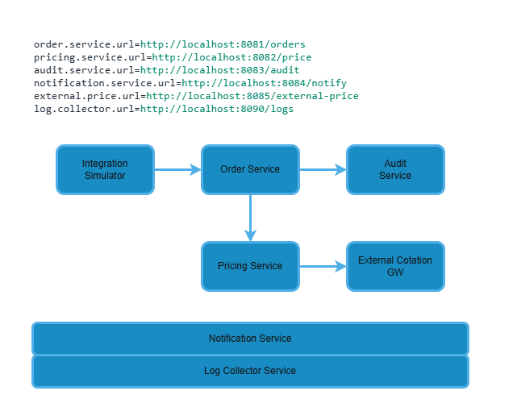

# Energy Trade Simulator

Energy Trade Simulator is a modular Java project designed to simulate a simplified energy trading ecosystem using microservices, REST communication, and event-driven logging.

The project is built with **Spring Boot**, **Undertow**, and **Log4j2**, aiming to demonstrate real-world service orchestration, observability, and maintainability in a distributed architecture.

---

## 🔧 Objectives

- Simulate a realistic trading lifecycle across loosely coupled services.
- Enable real-time observability via a centralized log collector.
- Serve as a blueprint for multithreaded, resilient, and modular system design.
- Showcase code readability, testability, and configuration best practices.

---

## 📦 Stack

- **Java 11**
- **Spring Boot 2.7**
- **Undertow** (replaces default Tomcat)
- **Log4j2** (with custom HTTP appender)
- **H2** (in-memory DB)
- **Maven**
- **Windows batch scripting** (for orchestration)

---

## 🧱 Microservices Overview

- `order-service`: Handles client trade requests and order emission.
- `pricing-service`: Simulates price retrieval or external price integration.
- `audit-service`: Persists events related to transactions and system actions.
- `notification-service`: Sends external communications (e.g., email, webhook).
- `external-cotation-gw`: Acts as a stubbed external pricing API.
- `log-collector-service`: Captures and centralizes logs from all services.
- `integration-sim`: CLI-based simulation client to trigger application scenarios.

 

---

## 📡 Architecture Highlights

- Custom `HttpLogCollectorAppender` for centralized structured JSON logging
- Environment-controlled boot process with readiness detection
- Health-check loop ensures log collector starts before other services
- Structured logs enriched with service metadata (`serviceName`) for filtering

---

## 🚀 Current Milestone — `v1.2.0-expiry`

The tag [`v1.2.0-expiry`](https://github.com/rubentrancoso/energy-trade/releases/tag/v1.2.0-expiry) introduces **Order Expiration & Cleanup**, expanding the robustness and integrity of the matching system.

This version ensures that expired orders are never executed, and introduces a scheduled cleanup task to maintain data consistency over time.

✅ **Implemented**
- Validation of expiration timestamp for incoming orders
- Filtering out expired counterpart orders during matching
- Status `EXPIRED` automatically assigned when appropriate
- Scheduled cleanup task (`@Scheduled`) to mark as `EXPIRED` all `PENDING` orders past their expiration timestamp
- Configurable cleanup interval via `application.properties`
- Test coverage for expired incoming orders and expired candidates
- Full audit and logging of expired order handling

→ [Full changelog: `v1.2.0-expiry` Release Page](https://github.com/rubentrancoso/energy-trade/releases/tag/v1.2.0-expiry)

---

## 🕘 Deprecated Milestones

### 🕘 `v1.1.0-matching`
⚠️ This milestone is no longer the active baseline. It was succeeded by `v1.2.0-expiry`.

The tag [`v1.1.0-matching`](https://github.com/rubentrancoso/energy-trade/releases/tag/v1.1.0-matching) introduced the **Order Matching Engine**, the first intelligent execution component of the platform.

✅ **Implemented**
- Automatic matching between BUY and SELL orders based on price and timestamp
- Partial and full execution logic with volume tracking
- Status transitions: `PENDING`, `PARTIAL`, `EXECUTED`
- Audit events and notifications dispatched on match
- Rejection of invalid orders (e.g. negative volume)
- Pretty-printed JSON logs for simulation and verification
- Extended simulation coverage with edge cases

→ [Full changelog: `v1.1.0-matching` Release Page](https://github.com/rubentrancoso/energy-trade/releases/tag/v1.1.0-matching)

---

### 🕘 `v1.0.0-base`
The tag `v1.0.0-base` marked the first stable and functional snapshot of this project.

✅ **Implemented**
- Services compile and run independently
- Structured logs are correctly emitted and collected centrally
- Logs are traceable to originating service via metadata
- Batch scripts orchestrate service startup with dependency awareness
- Orders can be created and logged using `integration-sim`

→ [Full changelog: `v1.0.0-base` Release Page](https://github.com/rubentrancoso/energy-trade/releases/tag/v1.0.0-base)

---

## 🧪 Planned Use Cases & Milestones

These features will be released incrementally and tagged for easy comparison.

| Feature                                     | Status     | Tag (planned)       |
|---------------------------------------------|------------|---------------------|
| Order Matching Engine (buy/sell execution)  | ✅ Delivered | `v1.1.0-matching`   |
| Order Expiration & Cleanup                  | ✅ Delivered | `v1.2.0-expiry`     |
| Order Cancellation                          | Planned    | `v1.3.0-cancel`     |
| Pricing Feed & Dynamic Simulation           | Planned    | `v1.4.0-pricing`    |
| Full Audit Trail & Reporting                | Planned    | `v1.5.0-audit`      |
| Observability: Dashboards or CLI tools      | Planned    | `v1.6.0-visuals`    |
| Stress Tests & Load Simulation              | Planned    | `v1.7.0-stress`     |


Each milestone will be versioned, tagged, and documented.

---

## 📁 Repository Structure
```text
energy-trade-sim/
├── order-service/
├── pricing-service/
├── audit-service/
├── notification-service/
├── external-cotation-gw/
├── log-collector-service/
├── integration-sim/
└── common-logging/
```


## 🛠️ How to Run the Project Using `start-all.bat`

This project includes a Windows batch script (`start-all.bat`) that automates the startup of all core services in separate terminal windows.

### ✅ Prerequisites

- Java 11+ installed and configured in your system PATH
- Maven installed and accessible via command line (`mvn -v`)
- A terminal that supports UTF-8 and emojis (Windows Terminal or CMD with chcp 65001)
- Ports 8080–8085 available for service binding

### 🚀 Running the Project

1. Open a terminal as Administrator (if needed for port permissions).
2. Navigate to the root of the project where `start-all.bat` is located.
3. Execute:

```bash
start-all.bat
```

This will:

- Open a new terminal window for each service:
  - Order Service
  - Pricing Service
  - Audit Service
  - Notification Service
  - External Cotation Gateway
  - Integration Simulator
- Display colored log output with emojis if UTF-8 is correctly configured.

### 🔍 Verifying Everything Works

- Look for the message `🚀 [Service Name] is up and running! 🌐` in each terminal.
- The integration simulator will fetch prices, post several test orders (including edge cases), and log results.
- Confirm that:
  - Logs from all services appear in the log collector
  - Audit events are stored and printed
  - Order matching is happening based on volume and price

### 🧪 Simulated Test Cases Include

- Buy/Sell pairs that match fully or partially
- Orders with extreme or invalid values (e.g. negative volume)
- Pretty-printed logs for easy inspection

---

If you face any encoding issues, ensure your terminal code page is set to UTF-8 using:

```cmd
chcp 65001
```

## ⚖ License

This project is licensed under the MIT License. See `LICENSE` file for details.


