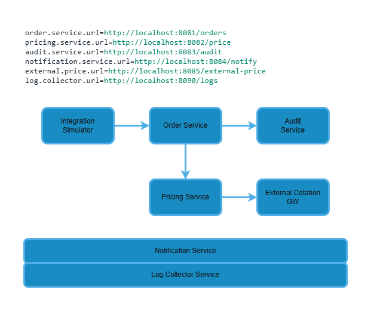

# Energy Trade Simulator

Energy Trade Simulator is a modular Java project designed to simulate a simplified energy trading ecosystem using microservices, REST communication, and event-driven logging.

The project is built with **Spring Boot**, **Undertow**, and **Log4j2**, aiming to demonstrate real-world service orchestration, observability, and maintainability in a distributed architecture.

---

## 🔧 Objectives

- Simulate a realistic trading lifecycle across loosely coupled services.
- Enable real-time observability via a centralized log collector.
- Serve as a blueprint for multithreaded, resilient, and modular system design.
- Showcase code readability, testability, and configuration best practices.

---

## 📦 Stack

- **Java 11**
- **Spring Boot 2.7**
- **Undertow** (replaces default Tomcat)
- **Log4j2** (with custom HTTP appender)
- **H2** (in-memory DB)
- **Maven**
- **Windows batch scripting** (for orchestration)

---

## 🧱 Microservices Overview

- `order-service`: Handles client trade requests and order emission.
- `pricing-service`: Simulates price retrieval or external price integration.
- `audit-service`: Persists events related to transactions and system actions.
- `notification-service`: Sends external communications (e.g., email, webhook).
- `external-cotation-gw`: Acts as a stubbed external pricing API.
- `log-collector-service`: Captures and centralizes logs from all services.
- `integration-sim`: CLI-based simulation client to trigger application scenarios.

 

---

## 📡 Architecture Highlights

- Custom `HttpLogCollectorAppender` for centralized structured JSON logging
- Environment-controlled boot process with readiness detection
- Health-check loop ensures log collector starts before other services
- Structured logs enriched with service metadata (`serviceName`) for filtering

---

## 🚀 Current Milestone — `v1.0.0-blueprint`

The tag [`v1.0.0-blueprint`](https://github.com/rubentrancoso/energy-trade/releases/tag/v1.0.0-blueprint) marks the first stable and functional snapshot of this project.

### ✅ Implemented

- Services compile and run independently
- Structured logs are correctly emitted and collected centrally
- Logs are traceable to originating service via metadata
- Batch scripts orchestrate service startup with dependency awareness
- Orders can be created and logged using `integration-sim`

---

## 🧪 Planned Use Cases & Milestones

These features will be released incrementally and tagged for easy comparison.


| Feature                                     | Status     | Tag (planned)       |
|---------------------------------------------|------------|---------------------|
| Order Matching Engine (buy/sell execution)  | Planned    | `v1.1.0-matching`   |
| Order Expiration & Cleanup                  | Planned    | `v1.2.0-expiry`     |
| Order Cancellation                          | Planned    | `v1.3.0-cancel`     |
| Pricing Feed & Dynamic Simulation           | Planned    | `v1.4.0-pricing`    |
| Full Audit Trail & Reporting                | Planned    | `v1.5.0-audit`      |
| Observability: Dashboards or CLI tools      | Planned    | `v1.6.0-visuals`    |
| Stress Tests & Load Simulation              | Planned    | `v1.7.0-stress`     |


Each milestone will be versioned, tagged, and documented.

---

## 📁 Repository Structure
```text
energy-trade-sim/
├── order-service/
├── pricing-service/
├── audit-service/
├── notification-service/
├── external-cotation-gw/
├── log-collector-service/
├── integration-sim/
└── common-logging/
```

## ⚖ License

This project is licensed under the MIT License. See `LICENSE` file for details.


